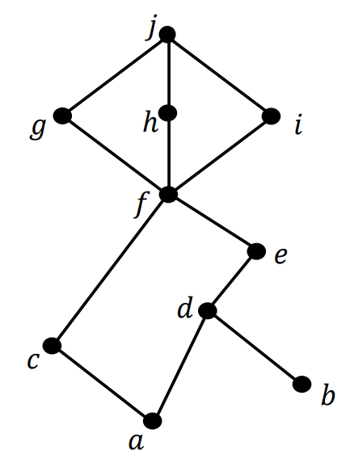

I think I’ve messed up a bit by not spending enough time studying for the finals. Usually, I go through all the past papers before an exam, but this time, that might not happen. So, I decided to prioritize and tackle problems I find particularly challenging, focusing on my weak areas and their contribution to the overall marks.

In this blog, I’ve shared my solutions to these problems. Each problem includes its numbering and source. My goal is to learn as much as possible, get used to the format, and hopefully do well on the finals! :)

**Note**: [CS1231S Discrete Structures](https://nusmods.com/courses/CS1231S/discrete-structures) is a computer science course typically taken in the first semester at NUS. It covers discrete mathematics with a focus on its applications in computer science. I found it quite challenging, probably because my math background isn’t the strongest.

---

## Problems on Relations and Functions

### AY2021/22 Semester 2 Problem 18

#### Part (a)

(i) The function $f$ is injective but not surjective, as we cannot find $n$ such that $f(n) = 0$.

(ii) The minimum of the function $f$ occurs when $(x-3)^2 = 0$, which gives $f = 7$. Since the codomain is $[7, \infty)$, the function is surjective. It is also injective because the domain $[3, \infty)$ restricts the function to the side after the minimum, ensuring uniqueness.

(iii) The function is injective because each value is unique. However, it is not surjective since it does not cover the negative rational numbers.

#### Part (c)

The set $D_{30}$ contains the elements $1, 2, 3, 5, 6, 10, 15, 30$. For the divide relation, the largest subsets with no pair of elements comparable (i.e., the maximal antichains) are: $\\{2, 3, 5\\}$ and $\\{5, 6, 10\\}$. If we draw the Hasse diagram, these sets represent the elements on the same level.

### AY2022/23 Semester 1 Problem 24 Part (c)

1. Choose $f:\mathbb{R}\to\mathbb{R}$ be a function by defining $f(x)=-x$.
2. Prove $f$ is injective.

   1. Let $x_1,x_2\in\mathbb{R}$ such that $f(x_1)=f(x_2)$.
   2. $-x_1=-x_2$ by the definition of $f$.
   3. $x_1=x_2$ by basic algebra.
   4. Hence, $f$ is injective.

3. Prove $f$ is surjective.

   1. Let $y\in R$.
   2. Choose $x=-y$, then we have $f(x)=-(-y)=y$, hence $f$ is surjective.

4. From 2. and 3., we conclude that $f$ is a bijection.
5. ($\implies$) Let $x,y\in\mathbb{R}$ such that $x\leq y$.

   1. $-x\geq-y$ by basic algebra.
   2. $f(x)\geq f(y)$ by the definition of $f$.

6. ($\impliedby$) Let $x,y\in\mathbb{R}$ such that $f(x)\geq f(y)$.

   1. $-x\geq-y$ by the definition of $f$.
   2. $x \leq y$ by basic algebra.

7. From 5. and 6., we have $x\leq y\iff f(x)\geq f(y)$. Therefore, $(\mathbb{R},\leq)\sim (\mathbb{R},\geq)$.

### AY2022/23 Semester 2 Problem 24

#### Part (a)

1. Given that $f([x])=g(x)$ for all $x\in X$.
2. Let $[x]\in X/\sim$ be an equivalence class of $\sim$ for some $x\in X$.
3. Since $g$ is a function, there exists an image of $[x]$ under $f$.
4. To show that the image is unique, consider $f([x_1])=g(x_1)$ and $f([x_2])=g(x_2)$ such that $[x_1]=[x_2]$.
5. Since $[x_1]=[x_2]$, we have $x_1\sim x_2$ by Lemma Rel. 1.
6. $g(x_1)=g(x_2)$ by the definition of $g$. Hence, the image of $[x]$ is unique.
7. Therefore, $f$ is well defined, as there exists an image of $[x]$ for all $[x]\in X/\sim$, and that image is unique.

#### Part (b)

1. Let $[x_1],[x_2]\in X/\sim$ such that $f([x_1])=f([x_2])$.
2. $g(x_1)=g(x_2)$ by the definition of $f$.
3. We have $x_1\sim x_2$ by the definition of $g$.
4. $[x_1]=[x_2]$ by Lemma Rel. 1.
5. Therefore, $f$ is injective.

---

## Problems on Cardinality and Mathematical Induction

### AY2021/22 Semester 2 Problem 21 Part (b)

**Note**: For this problem, I initially came up with `const f = x => x === 0.5 ? 1 : x` (it's just easier to type this way). However, this won't be surjective since the number $0.5$ itself won't be covered. Therefore, we need to recursively handle the remaining cases as follows:

1. Define a bijective function:
   $f(x) = 2x\  \text{if}\  x = \frac{1}{2^n} \text{ for some } n \in \mathbb{Z}^+, \ \text{otherwise} \ f(x) = x.$
2. Prove that $f$ is injective:

   1. Let $f(x_1)=f(x_2)$ for some $x_1,x_2\in (0,1)$.
   2. If $f(x_1)=f(x_2)=1/2^k, \exists k\in \mathbb{Z}_{\geq 0}$, then $x_1=x_2=1/2^{k+1}$.
   3. If $f(x_1)=f(x_2)\neq 1/2^k, \exists k\in \mathbb{Z}_{\geq 0}$, then $x_1=x_2=1$.
   4. In both cases 2. and 3., $f$ is injective.

3. Prove that $f$ is surjective:

   1. Let $y\in(0, 1]$.
   2. If $y=1/2^k, \exists k\in \mathbb{Z}_{\geq 0}$, then $y=f(1/2^{k+1})$.
   3. If $y\neq 1/2^k, \exists k\in \mathbb{Z}_{\geq 0}$, then $y=f(y)$.
   4. In both cases 3. and 4., there exists $x$ such that $f(x)=y$, hence $f$ is surjective.

4. Therefore, $f$ is bijective since it is both injective and surjective.

### AY2022/23 Semester 1 Problem 25 Part (a)

1. Since $B$ is a subset of $A$, $A$ is infinite because $B$ is an infinite set.
2. Suppose $A$ is countable. Then, $A$ is countably infinite.
3. There is a bijection from $B$ to $A$ since $B$ is also countably infinite. This statement leads to a contradiction, as there is no surjection from $B$ to $A$ (and thus no bijection).
4. Therefore, $A$ is not countable.

### AY2022/23 Semester 2 Problem 21

1. Let $P(n) \equiv (\text{Even}(F_n) \iff \text{Even}(F_{n+3}))$ for all $n \in \mathbb{N}$.

2. (Basis Step)

   1. $F_3 = F_2 + F_1 = (F_1 + F_0) + F_1 = (1 + 0) + 1 = 2$ by the definition of the Fibonacci sequence.
   2. $P(0) \equiv (\text{Even}(F_0) \iff \text{Even}(F_3)) \equiv (\text{Even}(0) \iff \text{Even}(2))$ is true.

3. (Inductive Step)

   1. Suppose $P(k)$ is true for some $k \in \mathbb{N}$, i.e., $\text{Even}(F_k) \iff \text{Even}(F_{k+3})$.
   2. Inductive Hypothesis: Assume $P(0) \land P(1) \land P(2) \land \cdots \land P(k)$ are true.
   3. By the definition of the Fibonacci sequence, $F_{k+1} = F_k + F_{k-1}$.
   4. From the definition, $\text{Even}(F_{k+1}) \iff (\text{Even}(F_k) \iff \text{Even}(F_{k-1}))$ by Fact 1.
   5. By the inductive hypothesis, $\text{Even}(F_k) \iff \text{Even}(F_{k+3})$, and $\text{Even}(F_{k-1}) \iff \text{Even}(F_{k+2})$.
   6. Thus, $\text{Even}(F_{k+1}) \iff (\text{Even}(F_{k+3}) \iff \text{Even}(F_{k+2}))$.
   7. By the definition of the Fibonacci sequence, $\text{Even}(F_{k+1}) \iff \text{Even}(F_{k+4})$.

4. Hence, $P(k+1)$ is true.
5. Therefore, by Strong Mathematical Induction, $\forall n \in \mathbb{N}, P(n)$ is true.

### AY2022/23 Semester 2 Problem 25

1. Consider $B_k=\\{(a_0,a_1,a_2,\ldots)\in B : \forall n\geq k(a_n=0)\\}$ for each $k\in \mathbb{Z}^+$. Note that $B_k$ is the set of all infinite sequences where every element after the first $n$ elements is zero.
2. There are as many as $2^k$ elements in $B_k$ as each of the first $k$ elements can be either $0$ or $1$.
3. $\bigcup_{i=1}^{\infty} B_k\subseteq B$ since every element in $B_k$ is also in $B$.
4. Consider $b=(b_0,b_1,b_2,\ldots)\in B$, we know that there exists some $k\in\mathbb{N}$ such that for all $n\geq k$, $b_n=0$. Hence, $b\in \bigcup_{i=1}^{\infty} B_k$. In other words, $B\subseteq \bigcup_{i=1}^{\infty} B_k$ .
5. From 3. and 4., $B= \bigcup_{i=1}^{\infty} B_k$. Since $B_k$ is countable, $\bigcup_{i=1}^{\infty} B_k$ is also countable by the generalization of Lemma 9.4.
6. Therefore, $B$ is countable.

---

## Problems on Counting and Probability

### AY2021/22 Semester 2 Problem 19

#### Part (a)

(i) Since each person is indistinguishable, this is a combination problem that allows repetition. The total number of ways is $\binom{3+4-1}{4-1} = 20$ (splitting 3 balls into 4 boxes, where each box can have at least 0 balls).

(ii) There are $4$ ways since there are a total of $4$ stalls.

(iii) First, select $2$ stalls from $4$ stalls. Then, split $3$ people into $2$ different stalls with at least one person in each stall: $\binom{4}{2} \times \binom{3-1}{2-1} = 12$ ways.

#### Part (b)

(i) $P(\text{Disease}\vert\text{Positive})=\frac{P(\text{Positive}\vert\text{Disease})\times P(\text{Disease})}{P(\text{Positive})}=\frac{0.85\times 0.001}{0.1}=0.0085$.

(ii) $P(\text{Positive}\vert\overline{\text{Disease}})=\frac{P(\overline{\text{Disease}})\vert\text{Positive}\times P(\text{Positive})}{P(\overline{\text{Disease})}}=\frac{(1-0.0085)(0.1)}{0.999}=0.0992$.

#### Part (c)

Note that the number of equivalence relations is the same as the number of partitions.

(i) $n=2$: there are $1$ (two components) $+$ $1$ (one component) $=2$ ways.

(ii) $n=3$: there are $1$ (three components) $+3$ (two components) $+1$ (three components) $=5$ ways.

(iii) $n=4$: there are $1$ (four components) $+\binom{4}{1}$ (three components with one tripleton) $\binom{4}{2}$ (three components with one doubleton) $+\binom{4}{2}/2$ (two components with two doubleton) $+1$ (four components) $=15$ ways.

#### Part (d)

(i) By the pigeonhole principle, if Dueet pulls out $10$ socks, there will be at least $4$ socks of the same color, since $10/3 = 3$ with a remainder.

(ii) If we divide the triangle into four smaller equilateral triangles of equal area, the pigeonhole principle guarantees at least one small triangle will contain $2$ seeds. Since each small triangle has a width of $2$ meters, these two seeds must be within $2$ meters of each other.

### AY2022/23 Semester 1 Problem 22

(a) $\binom{10-6+3-1}{3-1}=15$.

(b) $P(A\cup B)=P(A)+P(B)-P(A)P(B)\implies P(B)=\frac{P(A\cup B)-P(A)}{1-P(A)}=(0.6-0.2)/(1-0.2)=0.5$.

(c) $\frac{1}{6}\left(\frac{5+4+3+2+1}{6}\right)=\frac{15}{36}=\frac{5}{12}$.

(d) By the pigeonhole principle, $838 / 12 = 69$ with some remainder. Therefore, there are at least $70$ students born in the same month.

(e) By the linearity of expectation, the sum is the same as two times the expected value of a single card: $2\times(1+2+\cdots+13)/13=14$.

(f) $P_{(i)}=(0.25)(0.6)+(1-0.25)(0.3)=0.375$ and $P_{(ii)}=(0.6)(0.25)/0.375=0.4$.

(g) (i): $(3)(2)=6$ and (ii): $P(n,k)$.

### AY2023/24 Semester 1 Problem 25

(a) $\binom{5}{3}(0.6^3)(0.4^2)=0.3456$.

(b) $k=2$. The probability of getting an odd number of heads is the same as that of getting an even number for a fair coin.

(c) Multiset Permutation: $\frac{8!}{5!3!}=56$.

(d) We can pack $2$ tasks together to guarantee an even number of tasks. The problem now becomes a stars and bars problem: $\binom{8+4-1}{4-1}=165$ ways.

(e) $P(\text{Google}\vert\text{Bonus})=(0.8)(0.85)/(0.8\times0.85+0.95\times 0.15)=0.8267$.

(f) The numbers that could be read upside down are $0,1,6,8,9$. Some of these have duplicates: the middle number could be $0,1,8$. The first digit could be any of the five numbers, since even if it's $6$, there is a corresponding $9$ that causes confusion. Therefore, the total number of ways is $5^5 - 5 \times 5 \times 3 = 3050$ ways.

(g) For part (i), there are $2^n$ ways to create a function (each element maps to either the first or second output). The non-surjective case occurs when all elements in $a$ map to one of the outputs (2 ways). The answer is $2^n - 2$. Similarly, for part (ii), the number of functions is $3^n - \binom{3}{1} 2^n + \binom{3}{2} = 3^n - 3 \times 2^n + 3$, since there are 3 ways to choose one element to not be connected, and the remaining elements have $2^n$ ways to create a function. However, we double-count the cases where another element is left out, so we add $3$ back to fix this.

### AY2023/24 Semester 2 Problem 27

(a) $\frac{14\times 13 - (9\times 8+5\times 4)}{14\times 13}=90/182=45/91$.

(b) The number of ways to draw no more than two spades is $\binom{13}{0}\binom{39}{6}+\binom{13}{1}\binom{39}{5}+\binom{13}{2}\binom{39}{4}=17163042$. The number of ways to draw six cards is $\binom{52}{6}=20358520$. The answer is approximately $0.843$.

(c) Even numbers on the dice are $2, 4, 6$. With the given condition, we can have a trivial probability for each number of $2/21$, $4/21$, $6/21$. Therefore, the total probability is $12/21 = 4/7$.

(d) $P(A\vert\text{defected})=\frac{(0.5)(25)}{(0.5)(0.25)+(0.4)(0.35)+(0.2)(0.4)}=25/69$.

(e) For this problem, we can manually find the number of ways to produce all differences from $0$ to $5$. The answer is $\frac{(0)(6) + (1)(10) + (2)(8) + (3)(6) + (4)(4) + (5)(2)}{36} = 35/18 \approx 1.944$.

(f) Stars and bars: $\binom{6+3-1}{3-1}=28$.

(g) We can factorize $10^6$ as $2^6 \times 5^6$. If we write $10^6 = nmk$, then $n = 2^{n_1} 5^{n_2}$, $m = 2^{m_1} 5^{m_2}$, and $k = 2^{k_1} 5^{k_2}$, where $n_1 + m_1 + k_1 = n_2 + m_2 + k_2 = 6$. So, this is exactly the same as the last problem, except that we need to do stars and bars for both $2$ and $5$, which gives $28^2 = 784$.

---

## Problems on Graphs and Trees

### AY2021/22 Semester 2 Problem 20

#### Part (b)

(i) Using Euler's formula: $e=2\times 4=8\leq 2(2+4)-4=8$. It is a planar graph.

(ii) Similary: $e=3\times 4=12$ but $2(7)-4=10$. Since $12>10$, it is not a planar graph.

(iii) Euler's formula: $f=e-v+2$. The graph needs to have $8+5-2=11$ edges. The simple graph with $5$ vertices have at most $5(4)/2=10$, so it is not possible to.

### AY2023/24 Semester 1 Problem 24

#### Part (a)

Using Prim's algorithm, starting from vertex $0$ (the first entry in the matrix), the cheapest option is to go to vertex $1$, which costs $3$. Next, we go to vertex $3$, which also costs $3$. From there, we proceed to vertex $2$, which costs $4$. Finally, the only option left is to go to vertex $4$, which costs $5$. The total weight of the minimum spanning tree is: $3+3+4+5=15$.

#### Part (b)

We calculate $A^4$ (output omitted). From this, we see that $A_{13}$ represents the number of walks of length $4$ from $v_1$ to $v_3$, which is 68.

#### Part (c)

(i) **True**, since removing an edge from a graph with a circuit still keeps it connected. The Euler trail remains valid as we can still traverse the same path.

(ii) **True**. There are four possibilities: one with two circuits on a single vertex, one with one circuit on each vertex, one with one circuit on one vertex and the two vertices adjacent, and one with parallel edges between two vertices.

(iii) **False**. By the handshaking theorem, the graph has a total degree of $n(n-2)$, which must be even. However, if n is odd (e.g., $n = 3)$, the claim is false.

#### Part (d)

The first connected component with $k$ vertices has $k(k-1)/2$ edges, and the second component with $n-k$ vertices has $((n-k)(n-k-1)/2)$ edges. To minimize the total number of edges, we find the value of $k$ that minimizes the sum of these edges. Solving $\frac{d}{dk}(n^2-2nk-n+2k^2)/2+1=0$, we get $k=n/2$. Therefore, the total number of edges is $n(n-2)/4+1$.

#### Part (e)

Looking at the tree, we see that the root node is $S$, and the first left node is $U$. The left subtree contains $E,C,R,A,U$, and the right subtree contains $O,I,D,T,N$. Using a similar approach, we can recursively search for the nodes to get the inorder traversal: $E,R,C,U,A,S,O,D,I,N,T$.

### AY2023/24 Semester 2 Problem 28 Part (g)

We can model the country with a complete graph $K_{30}$ where each vertex represents a different city. Originally, there are $\binom{30}{2} = 435$ roads. We can remove the roads until the graph is a tree (connected and acyclic), which has 29 edges (roads). This way, there is still a path between each city, since trees are connected. The number of roads removed is $435 - 29 = 406$.

---

## Some Warm Up Problems

These are the problems I planned to do the night before the exam, as a warm-up. They require less work but are great for refining the concepts. I didn't do the solutions for them; I just included the answers as a reference when thinking about them in my head.

### AY2021/22 Semester 2 Problem 2

Aiken is taking the CS1231S final exam which consists of the dreadful MRQ (multiple-response questions). If each MRQ has 5 options A, B, C, D and E, in how many ways can Aiken write his answer for each MRQ, assuming that he writes at least one option in his answer. Note that the order of the options in his answer does not matter, for example, ABC, ACB and BCA are considered the same answer. **(Answer: 31)**

### AY2021/22 Semester 2 Problem 6

Given the set $A=\\{1,2,3,4,5\\}$ and bijection $f:A\to A$ as follows:
$f=\\{(1,3), (2,4), (3,5), (4,1), (5,2)\\}$.
What is the order of $f\circ f$? **(Answer: 5)**

### AY2022/23 Semester 1 Problem 9

Given a set $A$ with two elements, how many relations on $A$ are not transitive? **(Answer: 3)**

### AY2022/23 Semester 1 Problem 15

Given the recurrence relation $a_n=5n+a_{n-1}$ with initial value $a_0 = 4$, what is the value of $a_{20}$? **(Answer: 1054)**

### AY2022/23 Semester 2 Problem 6

How many partitions of a set with 4 elements are there? **(Answer: 15)**

### AY2022/23 Semester 2 Problem 11

The Hasse diagram of a partial order $\preceq$ on a set $K=\\{a, b, c, d, e, f, g, h, i, j\\}$ is shown below. How many possible linearization of $\preceq$ are there? **(Answer: 42)**

### AY2023/24 Semester 1 Problem 7

What is $\vert \\{(x, y) \in A \cup B : 2 \leq x \leq 5 and 3 \leq y \leq 7\\}\vert$, where $A = \\{(x, y)\in \mathbb{Z}\times\mathbb{Z}: x= 2z\ \text{for some} z\in\mathbb{Z}\\}$ and
$B = \\{(x, y)\in \mathbb{Z}\times\mathbb{Z}: y= 3z\ \text{for some z}\in\mathbb{Z}\\}$? **(Answer: 14)**

### AY2023/24 Semester 1 Problem 11

Let $A$ and $B$ be sets. Let $R$ be a relation from $A$ to $B$ such that $\forall(x, y) \in A \times B (x R y \iff y = x + 1).$ For which of the following pairs of $A$ and $B$, is $R$ a function? **(Answer: Only (i) and (iv))**

(i) $A = B = \varnothing$.  
(ii) $A = {1}$ and $B = {0}$.  
(iii) $A = \mathbb{Z}$ and $B = {0}$.  
(iv) $A = {1}$ and $B = \mathbb{Z}$.

### AY2023/24 Semester 2 Problem 7

Let $f:\mathbb{N}\to\mathbb{N}$ and $f(n)=n(n^2-1)$ Which of the following statements are true? **(Answer: Neither (i) nor (ii).)**

(i) $f$ is injective.  
(ii) $f$ is surjective.

### AY2023/24 Semester 2 Problem 20

A box contains 5 red balls and 3 blue balls. Dueet picks two balls without replacement from the box. What is the probability that the second ball is red given that the first ball is red? **(Answer: 4/7)**

---

## Final Thoughts

I definitely learned a lot from these problems and feel more confident about the exam. You can also check out the cheat sheet I created in this [blog](https://phanuphats.com/posts/2024-11-19-cs1231s-cheat-sheet). It only includes the information I usually misunderstand or often forget. If you’re currently taking or planning to take this course, make sure you understand all the concepts. Tutorials are also great for clarifying uncertainties. Try solving problems before looking at the solutions as you’ll learn so much more that way. All the best! :)
